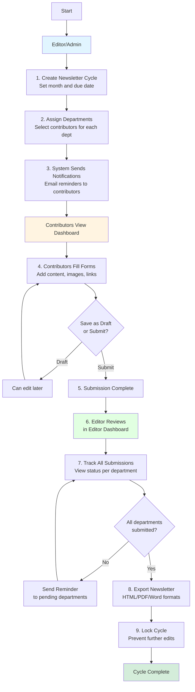

# Monthly Newsletter Guide

## Overview
The Monthly Newsletter system enables collaborative content creation across multiple departments. Editors (managers/admins) set up newsletter cycles and assign contributors, while assigned contributors submit content for their departments.

---

## Workflow Diagram

---

## Guide for Editors (Managers/Admins)

### Role: Newsletter Editor
**Who:** Managers, Tenant Admins, Super Admins

### Step 1: Create a Newsletter Cycle
1. Navigate to **Monthly Newsletter** from the sidebar
2. Click on the **Editor View** tab
3. Click **"+ New Cycle"** button
4. Fill in:
   - **Month**: Select the newsletter month/year
   - **Due Date**: Set when contributions are due
   - **Open Date**: When contributors can start submitting (optional)
5. Click **Create Cycle**

**Tip:** Create cycles in advance to give contributors adequate time.

---

### Step 2: Assign Departments & Contributors
1. Go to the **Assignments** tab
2. For each department:
   - Click **"+ Add Assignment"**
   - Select **Department** (e.g., IT, HR, Marketing)
   - Choose **Assignees** (users who will contribute)
   - Enable **"Allow Multiple Clinics"** if needed
   - Click **Save**

**Tip:** You can assign multiple people to the same department for collaboration.

---

### Step 3: Monitor Submissions
1. In the **Editor View** tab:
   - Select the active cycle from the dropdown
   - View the **Department Submissions** table showing:
     - Department name
     - Number of assignees
     - Submission status (Not Started/Draft/Submitted)
     - Last activity timestamp

**Status Meanings:**
- 🔘 **Not Started**: No content added yet
- ✏️ **Draft**: Content saved but not submitted
- ✅ **Submitted**: Ready for review

---

### Step 4: Send Reminders
**For all departments:**
- Click **"Send Reminders"** button at the top

**For specific departments:**
- Click the **bell icon** (🔔) next to any department with pending submissions

**Note:** Reminders are automatically sent based on the cycle schedule.

---

### Step 5: Review Submissions
1. Click **"View"** next to any submitted department
2. Preview the content in a modal dialog
3. Check:
   - Written content
   - Images/attachments
   - Links and formatting

---

### Step 6: Export Newsletter
1. Click **"Export Newsletter"** dropdown
2. Choose format:
   - **HTML**: Opens in new window for web viewing
   - **PDF**: Downloads ready-to-print document
   - **Word**: Downloads editable .docx file

**Tip:** Export to HTML first to preview before generating PDF/Word.

---

### Step 7: Lock the Cycle
Once all submissions are complete and exported:
1. Click **"Lock Cycle"** button
2. Confirm the action
3. **Effect:** Contributors can no longer edit or submit content

⚠️ **Warning:** Locking is permanent for that cycle!

---

### Step 8: Manage Templates (Optional)
1. Go to **Templates** tab
2. Create custom form templates:
   - Define fields (text, images, links)
   - Set field requirements
   - Assign templates to departments
3. Save template for future cycles

---

## Guide for Assigned Contributors

### Role: Department Contributor
**Who:** Users assigned to specific departments

### Step 1: Check Your Assignments
1. Navigate to **Monthly Newsletter** from the sidebar
2. View **My Contributions** tab
3. See:
   - Current newsletter cycle details
   - Due date and days remaining
   - Your assigned department(s)
   - Status of each assignment

---

### Step 2: Fill Your Department Form
1. Click **"Fill Form"** (or **"Edit Submission"** if already started)
2. A form opens with fields based on your department's template
3. Complete all required fields:
   - Text content
   - Upload images (if applicable)
   - Add links or attachments
   - Follow any specific instructions

**Tip:** Fill in as much as you can, even if you're not done yet!

---

### Step 3: Save as Draft
- Click **"Save Draft"** at any time
- Your progress is saved
- You can return later to continue editing
- Draft status visible to editors

**Note:** Drafts are **not** final submissions.

---

### Step 4: Submit Your Contribution
When your content is ready:
1. Review all fields for accuracy
2. Click **"Submit"** button
3. Confirm submission
4. Status changes to ✅ **Submitted**

⚠️ **Important:** After submitting, you may not be able to edit depending on cycle settings.

---

### Step 5: Track Your Status
Return to **My Contributions** to:
- See submission status
- Check last edited timestamp
- Re-edit if still in draft mode
- View how many days until due date

---

### Tips for Contributors

#### ✅ Do's
- ✅ Start early - don't wait until the due date
- ✅ Save drafts frequently
- ✅ Upload high-quality images (if required)
- ✅ Proofread content before submitting
- ✅ Check for broken links
- ✅ Follow your department's style guidelines

#### ❌ Don'ts
- ❌ Don't wait for the last day
- ❌ Don't submit without proofreading
- ❌ Don't ignore email reminders
- ❌ Don't use placeholder text in final submission
- ❌ Don't upload copyrighted images without permission

---

## Automated Reminders

The system automatically sends email reminders:
- **7 days before** due date
- **3 days before** due date
- **1 day before** due date
- **On** the due date (if not submitted)

Editors can also send manual reminders at any time.

---

## Frequently Asked Questions

### For Editors

**Q: Can I edit a locked cycle?**
A: No. Locking is permanent. Export and verify before locking.

**Q: Can I reassign a department mid-cycle?**
A: Yes, go to Assignments tab and modify assignees.

**Q: What if a contributor misses the deadline?**
A: You can extend the cycle or send individual reminders.

**Q: Can I preview before exporting?**
A: Yes, export to HTML first to preview in browser.

---

### For Contributors

**Q: Can I submit for multiple departments?**
A: Yes, if you're assigned to multiple departments.

**Q: What happens if I submit late?**
A: You can still submit, but it shows as overdue to editors.

**Q: Can I edit after submitting?**
A: Depends on cycle settings. Check with your editor.

**Q: What if I don't have content this month?**
A: Contact your editor or submit minimal content explaining why.

**Q: How do I add images?**
A: Use the file upload field in your department's form.

---

## Support

Need help? Contact your IT administrator or newsletter editor.

**Related Documentation:**
- [User Roles & Permissions](./PERMISSIONS_GUIDE.md)
- [Email Notifications Setup](./RESEND_SETUP.md)

---

*Last Updated: 2025*
